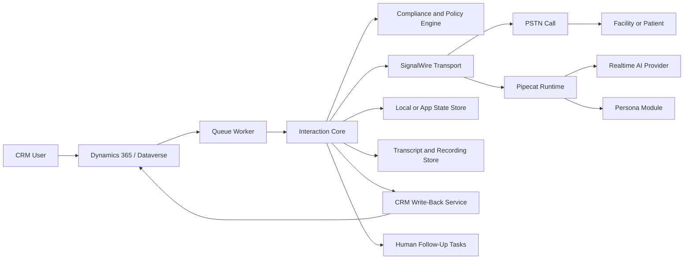
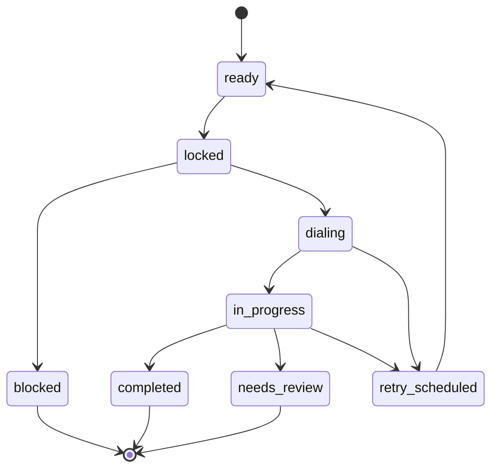
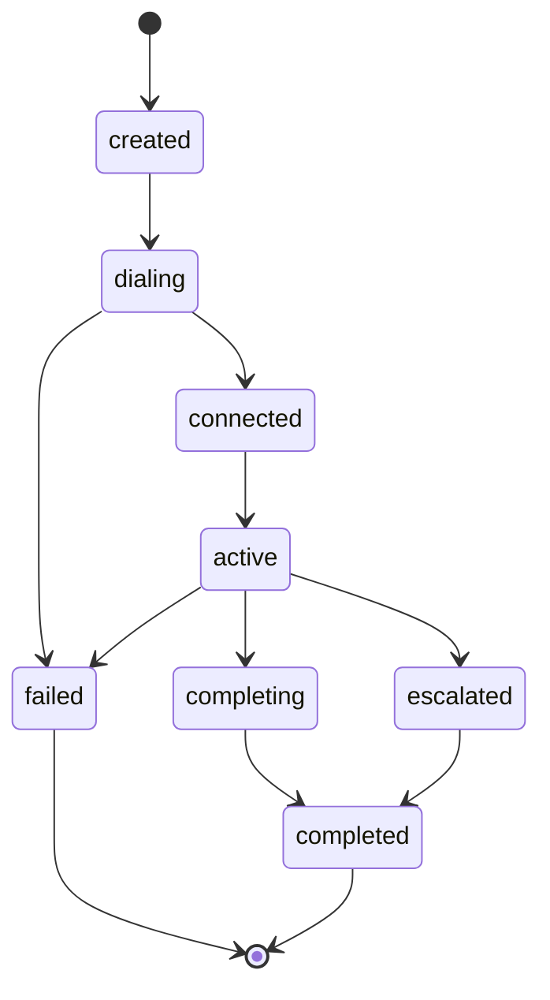
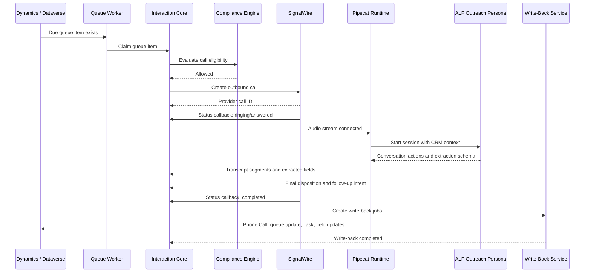

# openCloser Architecture

Status: Draft

Last updated: 2026-05-22

## Purpose

This document defines the target architecture for openCloser. The architecture is designed around a stable Interaction Core that can run different persona modules across multiple media transports. The first concrete implementation is CRM-driven outbound calling for assisted living facility outreach using Dynamics 365 / Dataverse, SignalWire, Pipecat, and a real-time AI model provider.

The smallest MVP build order is defined in [openCloser MVP](../prds/openCloser_MVP.md): mock call plus mock CRM first, mock call plus real CRM second, and real SignalWire call plus real CRM third.

## Architectural Principles

- Keep CRM as the business source of truth.
- Keep media transport separate from session orchestration.
- Keep persona behavior separate from infrastructure.
- Make every automated decision and state transition auditable.
- Make external callbacks idempotent.
- Prefer explicit adapters over provider-specific logic inside core workflow.
- Treat clinical personas as higher-risk workflows with additional gates.
- Make the first implementation simple enough for a small team to deploy.

## Recommended Initial Stack

- Language/runtime: Python for API, worker, and voice runtime integration.
- API framework: FastAPI.
- Worker: simple async background worker process.
- Voice runtime: scripted fixtures for Slices 1 and 2; Pipecat for Slice 3.
- Mock call transport: used for Slices 1 and 2.
- First production telephony transport: SignalWire.
- First AI model path: OpenAI Realtime through the Pipecat pipeline.
- First CRM adapter: Dynamics 365 / Dataverse Web API.
- MVP local state: SQLite or local JSON artifacts for Slice 1.
- Pilot business state: Dynamics 365 / Dataverse for Slices 2 and 3.
- Later durable app state: PostgreSQL when app-side session and write-back durability require it.
- Short-lived coordination: single worker for MVP; PostgreSQL row locks later, Redis optional later.
- Artifact storage: deployment-configurable object storage for transcripts, recordings, and large logs.
- Observability: structured logs, OpenTelemetry-compatible traces, and basic metrics.
- UI: CLI and local artifacts for development; Dynamics views/forms for pilot operations; no custom web UI for MVP.

Python is recommended first because Pipecat support is strongest there and it keeps the real-time audio path close to the worker/API code. The public architecture should still define interfaces clearly enough that future adapters can be implemented in another language if needed.

## System Context



## Logical Layers

### CRM Layer

The CRM layer owns business workflow and durable business records.

Initial CRM: Dynamics 365 / Dataverse.

Responsibilities:

- Store Accounts, Contacts, Campaigns, Queue Items, Phone Call activities, Tasks, and Opportunities.
- Create queue items from CRM workflow, views, campaigns, or lists.
- Receive structured call outcomes from openCloser.
- Remain the primary surface for sales and operations users in the first version.

### Interaction Core

The Interaction Core owns workflow state and orchestration.

Responsibilities:

- Claim due queue items.
- Evaluate compliance and campaign policy.
- Start sessions.
- Coordinate transport, runtime, persona, transcript, and write-back.
- Normalize provider events into internal events.
- Maintain session state.
- Emit audit events.
- Schedule retries and follow-up actions.

The core must not contain hardcoded ALF, nurse, doctor, or sales logic.

### Transport Adapters

Transport adapters connect external media systems to the Interaction Core.

MVP adapters:

- Mock call transport for Slices 1 and 2.
- SignalWire PSTN/SIP outbound calling.

Future adapters:

- LiveKit or another WebRTC transport for app voice/video.
- WebSocket transport for local simulation.
- Other telephony carriers.

Transport adapters are responsible for provider-specific details such as call creation, status callbacks, media stream setup, hangup, and provider IDs. They should emit normalized events to the core.

### Runtime Adapters

Runtime adapters execute the real-time conversation pipeline.

Initial live-call adapter:

- Pipecat pipeline with provider-specific STT, LLM, TTS, or real-time model components.

Slices 1 and 2 use scripted conversation fixtures instead of the live-call
runtime so CRM integration can be validated before audio and model risk are
introduced.

Responsibilities:

- Connect audio input and output streams.
- Send session context to the persona.
- Receive persona/tool events.
- Stream transcript segments.
- Return final summary, extracted fields, and completion signal.

### Persona Modules

Persona modules define conversation behavior.

Responsibilities:

- Goal.
- Opening and disclosure.
- Allowed and disallowed claims.
- Questions.
- Objection handling.
- Structured extraction schema.
- Disposition rules.
- Completion criteria.
- Escalation rules.
- CRM write-back mapping.

Personas are versioned. Every session stores the exact persona ID and version used.

### Write-Back Layer

The write-back layer persists outcomes to CRM and other systems.

Responsibilities:

- Create Phone Call activities.
- Update queue item status and attempt count.
- Update Contact or Account fields when durable facts are verified.
- Create callback and review Tasks.
- Create Opportunities only when qualification rules are met.
- Retry failed writes idempotently.

Write-back should run through jobs so provider callbacks are not blocked by transient CRM failures.

## Repository Shape

Target structure:

```text
opencloser/
  apps/
    api/
    worker/
    dev-console/
  packages/
    core/
      queue/
      sessions/
      events/
      dispositions/
      compliance/
      writeback/
    transports/
      signalwire/
      livekit/
      websocket/
    runtimes/
      pipecat/
    personas/
      appointment-setter/
      alf-outreach/
      nurse-intake/
      doctor-visit/
    crm/
      dataverse/
      hubspot/
      salesforce/
  docs/
    ideas/
    prds/
    architecture/
    compliance/
    examples/
```

For the first implementation, only `apps/api`, `apps/worker`, `packages/core`, `packages/transports/signalwire`, `packages/runtimes/pipecat`, `packages/personas/alf-outreach`, and `packages/crm/dataverse` are required.

## Core Domain Model

### Campaign

A named workflow that controls persona, policies, and CRM mappings.

Important fields:

- `id`
- `name`
- `crm_campaign_id`
- `persona_id`
- `persona_version`
- `call_window_policy`
- `attempt_policy`
- `writeback_mapping_id`
- `status`

### Queue Item

A planned interaction attempt tied to CRM records.

Important fields:

- `id`
- `crm_queue_item_id`
- `campaign_id`
- `target_account_id`
- `target_contact_id`
- `phone_number`
- `timezone`
- `status`
- `attempt_count`
- `next_attempt_at`
- `locked_until`
- `last_session_id`
- `last_disposition`

### Session

One interaction attempt, such as one phone call.

Important fields:

- `id`
- `queue_item_id`
- `campaign_id`
- `persona_id`
- `persona_version`
- `transport_type`
- `runtime_type`
- `status`
- `started_at`
- `ended_at`
- `provider_call_id`
- `disposition`
- `summary`
- `transcript_artifact_id`
- `recording_artifact_id`

### Compliance Decision

The result of policy evaluation before the system acts.

Important fields:

- `id`
- `queue_item_id`
- `session_id`
- `decision`
- `rules_evaluated`
- `blocked_reasons`
- `evaluated_at`

### Interaction Event

An append-only event emitted by the core, transport, runtime, persona, or write-back layer.

Example event types:

- `queue_item_claimed`
- `compliance_allowed`
- `compliance_blocked`
- `dial_requested`
- `provider_call_started`
- `media_stream_connected`
- `transcript_segment_received`
- `persona_field_extracted`
- `persona_disposition_selected`
- `provider_call_ended`
- `writeback_requested`
- `writeback_completed`
- `writeback_failed`

### Write-Back Job

An idempotent job that persists session outcomes to CRM.

Important fields:

- `id`
- `session_id`
- `crm_target_id`
- `operation_type`
- `payload_hash`
- `status`
- `attempt_count`
- `last_error`

## State Machines

### Queue Item Status



### Session Status



## MVP Sequence

The thin MVP is intentionally staged so CRM integration is proven before real telephony:

1. Mock call, mock CRM.
2. Mock call, real CRM.
3. Real call, real CRM.

Slice 2 is a Dataverse substitution slice only: the queue source and CRM
write-back target become real, while the call transport and persona execution
remain fixture-driven. SignalWire and Pipecat live audio enter in Slice 3.

The sequence below represents the final Slice 3 path.



## CRM Integration

### Dynamics Tables

Use standard tables where possible and custom Dataverse tables where the standard model is too restrictive.

Slice 2 MUST verify live Dataverse metadata before write-enabled processing.
The implementation should document logical names, required fields, lookup
targets, option-set values, and approved update fields for the selected queue
representation before adding schema or updating records.

Recommended initial mapping:

- Account: facility or organization being called.
- Contact: person reached or known decision-maker.
- Campaign: named outreach effort.
- Custom Call Queue Item: planned call attempt.
- Phone Call Activity: immutable call history.
- Task: human callback or review action.
- Opportunity: created only after explicit qualification.

### Custom Call Queue Item Fields

Recommended fields:

- Campaign lookup.
- Account lookup.
- Contact lookup.
- Phone number.
- Time zone.
- Status.
- Next attempt at.
- Attempt count.
- Max attempts.
- Last disposition.
- Last session ID.
- Lock owner.
- Lock expiration.
- DNC or opt-out snapshot.
- Last error.

### Write-Back Rules

- Always update queue item status after an attempt or block.
- Create a Phone Call activity for connected calls.
- Create a Task for callback requests and human-review outcomes.
- Assign callback and review Tasks from the configured owner/team mapping unless
  an approved queue-item owner override is present.
- Update email only when the AI verifies or captures an email with sufficient confidence.
- Update Account notes only for durable facts, not speculative summary text.
- Create Opportunities only through explicit campaign qualification policy.

The Dataverse adapter owns field-name translation and CRM-required lookup
population. The Interaction Core continues to speak in normalized payloads and
MUST NOT depend on Dataverse logical names.

## API Surface

Initial API endpoints:

- `POST /webhooks/signalwire/status`
- `POST /webhooks/signalwire/media`
- `POST /sessions/{session_id}/events`
- `GET /healthz`
- `GET /readyz`

Internal API or service methods:

- `claim_due_queue_items(campaign_id, limit)`
- `evaluate_compliance(queue_item)`
- `start_session(queue_item, campaign)`
- `record_event(session_id, event)`
- `complete_session(session_id, outcome)`
- `enqueue_writeback(session_id)`

Provider webhooks must be authenticated where supported and deduplicated by provider event ID or derived idempotency key.

Slice 2 does not require the SignalWire webhook endpoints for the demo path.
Its external dependency is Dataverse Web API access for one queue item, Phone
Call activity, Task, and queue-status update.

## Configuration

Configuration should support:

- CRM connection details.
- Dataverse table, field, lookup, status, and owner/team mappings.
- SignalWire project, space, token, and phone number.
- AI provider credentials.
- Campaign to persona mapping.
- Call windows by campaign and time zone.
- Attempt policy.
- DNC and opt-out field mappings.
- Transcript and recording persistence policy.
- Write-back mappings.

Secrets must come from environment variables or a secret manager, not from repository files.

## Compliance and Safety Gates

The compliance engine evaluates policy before each outbound attempt.

Initial rule categories:

- Local call window.
- DNC.
- Opt-out.
- Consent where required.
- Max attempts.
- Campaign active status.
- Account active status.
- Required phone and time zone.
- Required AI disclosure.

For clinical personas, add:

- Patient identity verification.
- Clinical scope.
- Emergency red-flag handling.
- Human clinician escalation.
- Medical documentation policy.
- PHI retention policy.

This architecture does not itself make the deployment compliant. It provides the places where deployment-specific legal, regulatory, and operational rules must be configured and audited.

## Idempotency Strategy

External systems send duplicate callbacks and retries. The system must be idempotent at every boundary.

Required idempotency keys:

- Queue claim key: queue item ID plus lock version.
- Provider call key: session ID plus provider call ID.
- Provider event key: provider event ID when available, otherwise provider call ID plus event type plus timestamp bucket.
- Write-back key: session ID plus CRM operation type plus payload hash.

Repeated callbacks may update state if the transition is valid, but they must not create duplicate Phone Call activities, duplicate Tasks, or duplicate attempt counts.

## Error Handling

### Provider Failure

If the provider fails before call connection:

- Mark session `failed`.
- Store provider error.
- Update queue item according to retry policy.
- Do not create a connected-call Phone Call activity unless CRM policy requires attempt activities.

### Runtime Failure

If the AI runtime fails during a connected call:

- Attempt graceful call termination.
- Mark disposition `needs_human_review` or `failed_provider_error` depending on failure type.
- Write summary from available transcript if possible.
- Create review task when a human may need to follow up.

### CRM Write-Back Failure

If CRM write-back fails:

- Keep session outcome stored locally.
- Mark write-back job failed with retry metadata.
- Retry with exponential backoff.
- Surface error metrics and logs.

## Observability

Minimum fields in every structured log:

- `correlation_id`
- `queue_item_id`
- `session_id`
- `campaign_id`
- `provider_call_id`
- `crm_record_id`
- `event_type`

Minimum metrics:

- Queue items claimed.
- Calls attempted.
- Calls connected.
- Calls completed.
- Calls blocked by rule.
- Disposition counts.
- Average call duration.
- Provider errors.
- Runtime errors.
- CRM write-back failures.
- Write-back retry count.

## Security and Privacy

- Store secrets outside source control.
- Encrypt sensitive data at rest where the deployment platform supports it.
- Use TLS for webhook and media endpoints.
- Restrict CRM credentials to the minimum required privileges.
- Avoid logging raw PHI or full transcripts by default.
- Support transcript redaction or external artifact storage.
- Record persona version, model provider, and model configuration for auditability.

## Extension Points

### New Persona

To add a persona:

1. Define persona metadata and version.
2. Define opening, disclosures, allowed claims, extraction schema, dispositions, and escalation rules.
3. Define CRM write-back mapping.
4. Attach persona to a campaign.
5. Run simulated sessions before live calls.

### New CRM

To add a CRM:

1. Implement queue item read and claim operations.
2. Implement account/contact read operations.
3. Implement write-back operations.
4. Implement idempotency support for CRM writes.
5. Map normalized openCloser fields to CRM-specific fields.

### New Transport

To add a transport:

1. Implement outbound or inbound session creation.
2. Normalize provider status events.
3. Connect media stream to runtime adapter.
4. Implement hangup and error handling.
5. Provide idempotency keys for callbacks.

## Future App Voice and Video

App voice and video should reuse the same Interaction Core and persona modules.

```text
Phone transport:
  SignalWire PSTN/SIP -> Pipecat -> Persona -> Core -> CRM

App voice/video transport:
  WebRTC/LiveKit/native SDK -> Pipecat or media runtime -> Persona -> Core -> CRM
```

Doctor avatar rendering should be treated as a client and media-layer concern. The clinical persona should provide conversation state, spoken output, and nonverbal cues only through explicit interfaces. Clinical safety logic should live in persona policy and protocol components, not in avatar rendering.

## Implementation Order

1. Define domain models and event types.
2. Build a mock CRM adapter and queue worker simulation.
3. Build a mock call transport that can emit connected, no-answer, failed, completed, and duplicate callback events.
4. Build persona schema and ALF outreach persona.
5. Build write-back job model with idempotency.
6. Prove Slice 1 with mock call plus mock CRM.
7. Add Dataverse metadata discovery, queue intake, and write-back adapter.
8. Prove Slice 2 with mock call plus real CRM.
9. Add SignalWire outbound dialing and status callbacks.
10. Add Pipecat runtime integration.
11. Prove Slice 3 with real call plus real CRM.
12. Add operational metrics and failure retry handling.
13. Pilot with limited CRM records.

## Open Architecture Decisions

- Whether app-side session/audit state should stay SQLite through Slice 2 or move
  to PostgreSQL before pilot.
- Whether Slice 2 transcript storage should remain local pointer/summary-only or
  write pointers to CRM notes.
- Whether LiveKit should be the default app voice/video transport.
- Whether persona schemas should be YAML, Python classes, database records, or a hybrid.
- Whether the first dev console should be read-only monitoring or include campaign controls.
- How much clinical protocol logic belongs in persona configuration versus a separate clinical rules engine.
