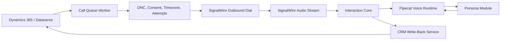

# openCloser Ideas

Working name: **openCloser**

openCloser is an open-source AI communication platform for healthcare-oriented outreach, scheduling, and virtual care conversations. The project starts with CRM-driven outbound calling for assisted living facility outreach, but the architecture should also support AI nurse and AI doctor workflows across phone, app voice, and app video.

The core idea is to separate the reusable interaction infrastructure from the specialized AI persona. The base layer handles lists, calls, consent, routing, state, notes, scheduling, CRM write-back, and auditability. The persona layer provides the goal, clinical or sales behavior, domain rules, and escalation logic.

## Why This Exists

Medx needs a low-cost, CRM-native way to contact prospects and patients without paying humans to perform every first-touch call. The first use case is calling assisted living facilities to ask whether they are interested, verify email, and schedule a callback for the following morning local time.

The same platform should later support:

- AI appointment setters for Medx services.
- AI nurse intake and follow-up calls.
- AI doctor conversations backed by a clinical reasoning system.
- Video visits in the Medx app with an AI doctor avatar.
- Human handoff when the AI identifies interest, risk, uncertainty, or clinical escalation.

## Core Principles

- CRM is the source of truth.
- No separate campaign UI is required for the first version.
- The platform works from CRM lists, queues, views, or campaign records.
- Every interaction writes back to CRM as structured data and timeline activity.
- The AI persona is swappable.
- The base layer should not know whether it is talking as a salesperson, scheduler, nurse, or doctor.
- The system must support phone first, then app voice and video.
- Medical use cases must have explicit safety boundaries, escalation rules, audit logs, and sourceable clinical logic.
- The project should be open source and deployable by small clinics without enterprise contact-center budgets.

## Two-Layer Architecture

### Layer 1: Interaction Core

The Interaction Core is the reusable engine. It owns workflow, telephony, queues, state, event handling, transcripts, CRM integration, and compliance controls.

Core responsibilities:

- Pull work from CRM call lists or queue records.
- Enforce call windows by local time zone.
- Enforce do-not-call, opt-out, consent, and max-attempt rules.
- Start outbound calls through SignalWire or another carrier.
- Receive call audio streams and route them into the AI runtime.
- Maintain call/session state.
- Capture transcript, summary, disposition, extracted fields, and next actions.
- Write Phone Call activities, Tasks, Contact updates, Account updates, and Opportunities back to CRM.
- Support human handoff.
- Support future app voice/video sessions.
- Provide logging, metrics, retries, and failure handling.

Initial technical direction:

- CRM: Dynamics 365 Sales Hub / Dataverse.
- Telephony: SignalWire for low-cost outbound PSTN/SIP.
- Voice runtime: Pipecat for real-time voice AI pipelines.
- AI models: OpenAI Realtime for first high-quality voice tests; later support modular STT, LLM, and TTS providers.
- Worker: background service that pulls due queue items and starts calls.
- API: service endpoint for SignalWire status callbacks, audio stream handling, and CRM write-back.

### Layer 2: Persona Modules

Persona Modules define the purpose and behavior of a conversation. They plug into the Interaction Core.

Examples:

- Sales appointment setter.
- ALF outreach assistant.
- Patient scheduling assistant.
- AI nurse intake agent.
- AI doctor visit agent.
- Post-discharge follow-up nurse.
- Medication adherence check-in.
- Chronic care management check-in.

Each persona should define:

- Goal.
- Opening script.
- Allowed claims.
- Required disclosures.
- Questions to ask.
- Structured data to extract.
- Objection handling.
- Safety boundaries.
- Escalation rules.
- Completion criteria.
- CRM write-back mapping.
- Follow-up actions.

For clinical personas, the persona module must also define:

- Medical scope.
- Clinical protocol references.
- Red-flag symptoms.
- Required human escalation.
- Emergency instructions.
- Patient identity verification requirements.
- Documentation standard.
- Whether the AI can educate, triage, schedule, or recommend care.

## First Product Slice

The first open-source slice should be an outbound appointment-setting caller for Medx ALF prospecting.

Workflow:

1. A Sales Hub workflow creates call queue records from a CRM Account list.
2. The worker pulls due records.
3. The worker checks DNC, call window, attempt count, and Account status.
4. SignalWire dials the facility phone.
5. Pipecat runs the ALF outreach persona.
6. The AI asks whether the facility is interested.
7. The AI verifies or captures email.
8. If interested, the AI asks whether tomorrow morning local time works for callback.
9. The system writes a Phone Call activity to the Account timeline.
10. The system updates Contact/Account email when appropriate.
11. The system creates a follow-up Task for the callback.
12. The system updates the queue item with final disposition.

Example dispositions:

- Interested - callback requested.
- Interested - email captured.
- Not interested.
- Call back later.
- Wrong number.
- No answer.
- Voicemail.
- Gatekeeper reached.
- Do not call.
- Needs human review.

## CRM Integration Model

Dynamics should own the business workflow.

Important CRM records:

- Account: facility, clinic, organization, or patient-facing entity.
- Contact: person reached or person to call.
- Call Campaign: named campaign such as `CO ALF First Outreach`.
- Call Queue Item: one planned call attempt tied to Account and optional Contact.
- Phone Call Activity: immutable call history and notes.
- Task: follow-up action for humans.
- Opportunity: created only when genuine sales potential is identified.

The platform should write:

- Phone Call activity with transcript/summary/disposition.
- Contact email updates after verification or capture.
- Account notes for durable facts only.
- Callback Task for interested prospects.
- Queue item status and attempt count.
- Opportunity only when qualification criteria are met.

## High-Level System Diagram



## Future AI Doctor Direction

openCloser should eventually support an AI doctor persona, but the doctor persona must be treated differently from sales outreach.

The AI doctor should not be just another prompt. It needs:

- Clinical protocol engine.
- Patient identity and consent handling.
- Medical history context.
- Medication and allergy context.
- Red-flag detection.
- Escalation to a licensed clinician.
- Clinical documentation output.
- Audit trail.
- Human review workflow.
- App-based video support.
- Avatar rendering for video visits.

Possible visit modes:

- Phone-only AI doctor conversation.
- App voice visit.
- App video visit with AI avatar.
- Human clinician joined to AI-supported visit.

The app video path should be designed as a separate transport under the same Interaction Core:

```text
Same persona and session state
Different media transport
Phone: SignalWire PSTN/SIP
App voice/video: WebRTC / LiveKit / native app SDK
Avatar: realtime rendered doctor avatar
```

## Open-Source Project Shape

Potential repository structure:

```text
opencloser/
  packages/
    core/
      queue/
      sessions/
      events/
      dispositions/
      compliance/
      writeback/
    transports/
      signalwire/
      livekit/
      websocket/
    runtimes/
      pipecat/
    personas/
      appointment-setter/
      alf-outreach/
      nurse-intake/
      doctor-visit/
    crm/
      dataverse/
      hubspot/
      salesforce/
  apps/
    worker/
    api/
    dev-console/
  docs/
    ideas/
    prds/
    architecture/
    compliance/
    examples/
```

The initial Medx implementation can live as a deployment/configuration of the open-source core, not as hardcoded product logic.

## Name Alternatives

Primary recommendation:

- **openCloser**

Other possible names:

- CareCallOS
- ClinicVoice
- OpenClinicVoice
- CareVoiceKit
- OpenCareVoice
- MedVoiceFlow
- CareReach

openCloser is the best current name because it is broad enough for sales outreach, patient scheduling, nurse workflows, doctor workflows, phone, and video.

## Questions for Later PRDs

- What CRM objects do we want for Call Campaign and Call Queue Item?
- Should queue items be Dataverse custom tables or standard Campaign/Marketing List records?
- What exact consent and DNC rules apply for each call type?
- Which calls are prospecting, care coordination, appointment reminders, or clinical care?
- What must be disclosed at the start of an AI call?
- What data is allowed to be collected by AI over phone?
- What counts as a qualified opportunity?
- What creates a callback Task?
- What creates an Opportunity?
- What clinical workflows are allowed without human clinician supervision?
- What app/video stack should power the AI doctor avatar?
- Should the avatar be realistic, stylized, or clearly synthetic?

## Follow-On Docs

Drafted:

1. [PRD: openCloser](../prds/openCloser_PRD.md).
2. [MVP: openCloser](../prds/openCloser_MVP.md).
3. [PRD: ALF Outbound Appointment Setter](../prds/ALF_Outbound_Appointment_Setter_PRD.md).
4. [Architecture: openCloser](../architecture/openCloser_Architecture.md).

Still needed:

1. Compliance: Outbound AI Calling, Consent, DNC, and Disclosure.
2. PRD: AI Nurse Intake.
3. PRD: AI Doctor Visit and App Video Avatar.
